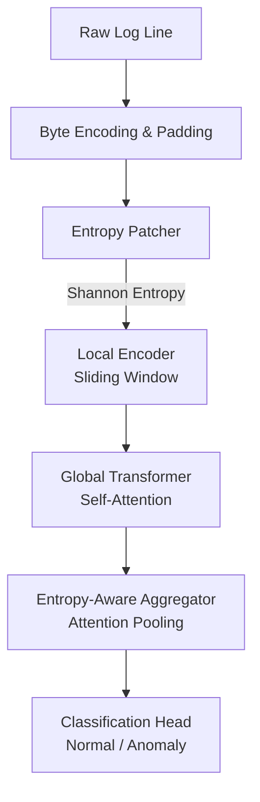

<div align="center">

# 🔬 LogBLT

**Byte Latent Transformer for Log Anomaly Detection**

[](#)
[](#)

A state-of-the-art log anomaly detection model based on Meta AI's **Byte Latent Transformer (BLT)** architecture. LogBLT operates directly on **raw bytes**, utilizing **Shannon entropy** to dynamically divide each log line into predictable (low-entropy) and unpredictable (high-entropy) patches.

</div>

---

## 🌟 Key Features

- **Raw Byte Processing:** No need for complex log parsing or tokenization. Operates directly on UTF-8 bytes.
- **Entropy-Based Patching:** Computes Shannon entropy to classify patches as High Entropy (HE) or Low Entropy (LE).
- **Hierarchical Architecture:** 
  - **Local Encoder:** Sliding-window byte transformer.
  - **Global Transformer:** Full self-attention over patches.
- **Entropy-Aware Aggregator:** Attention pooling intelligently weighted toward high-entropy patches.
- **Robust Loss Function:** Utilizes Focal Loss with class weighting to handle severe class imbalance in log datasets.

## 🏗️ Architecture

The pipeline seamlessly transforms raw logs into binary anomaly classifications:

`Raw bytes → Entropy Patcher → Local Encoder → Global Transformer → Entropy-Aware Aggregator → Classifier`



## 📊 Dataset

Trained and evaluated on the **BGL (Blue Gene/L Supercomputer) Log Dataset**.
- **Dataset Setup:** Stratified subsampling (300K Normal + 75K Anomaly)
- **Patch Size:** 8 Bytes per patch
- **Max Bytes:** 256 per log line

## 🚀 Quick Start

1. Clone the repository:
   ```bash
   git clone https://github.com/yourusername/LogBLT.git
   cd LogBLT
   ```
2. Open the Jupyter Notebook:
   ```bash
   jupyter notebook code.ipynb
   ```
3. Run the cells to train and evaluate the BLT-LAD model.

## ⚙️ Model Configuration

| Hyperparameter | Value | Description |
|----------------|-------|-------------|
| `max_bytes` | 256 | Maximum bytes per log line |
| `patch_size` | 8 | Bytes per patch |
| `entropy_threshold`| 1.5 | Shannon entropy threshold for patch type |
| `dim_local` | 256 | Dimensionality of Local Encoder |
| `dim_global` | 512 | Dimensionality of Global Transformer |
| `focal_gamma` | 2.0 | Gamma value for Focal Loss |
| `epochs` | 15 | Total training epochs |

## 📈 Performance

The model effectively learns to distinguish anomalous log lines from benign ones, achieving exceptional precision, recall, and F1 scores on the validation set after training for 15 epochs. It reaches an impressive **0.999** validation F1 score and perfect training accuracy.

*See the training loop in `code.ipynb` for detailed epoch-by-epoch performance.*

---
<div align="center">
  Built with ❤️ for advanced log anomaly detection.
</div>
