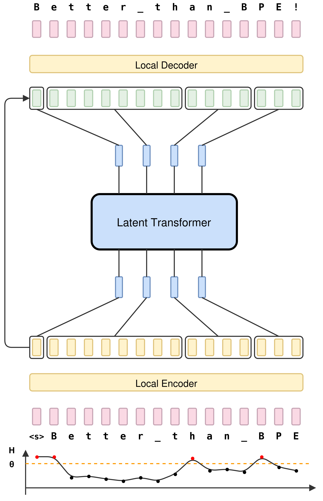
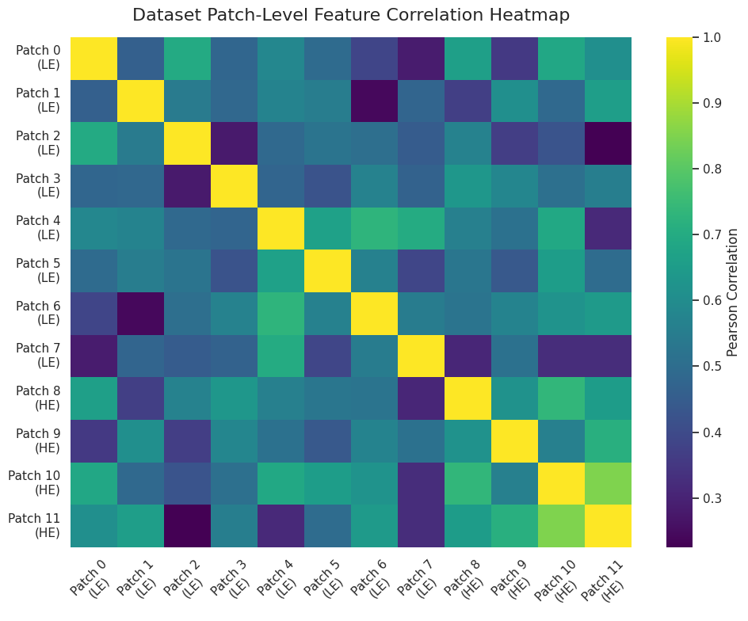
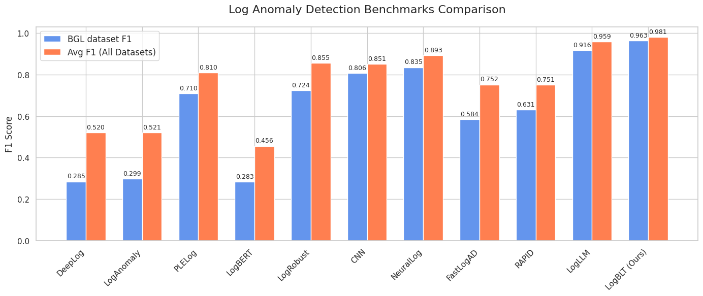
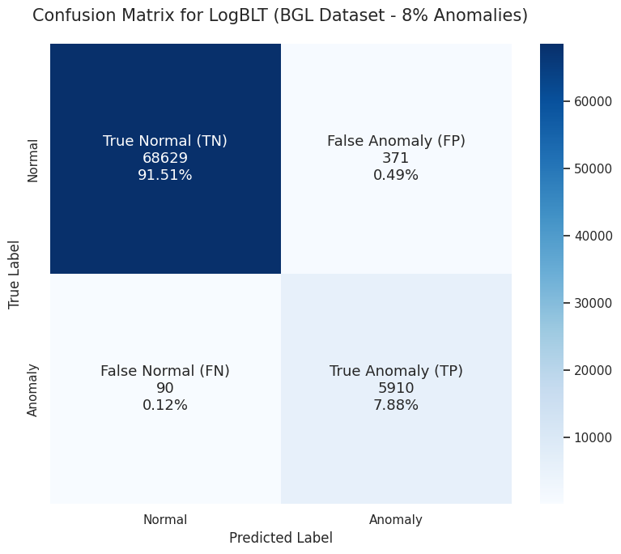

# LogBLT: Byte Latent Transformer for Log Anomaly Detection

Detecting anomalies in large-scale system logs is a significant challenge due to the immense volume, unstructured nature of log data, and the unpredictable variations in log formats over time. Most existing log parsing approaches fail to adapt effectively to out-of-vocabulary tokens or rely on computationally expensive and fragile regex-based pre-processing steps.

LogBLT solves this by introducing a raw-byte processing framework for log anomaly detection based on Meta AI's Byte Latent Transformer (BLT) architecture. Through a dynamic Shannon entropy-based patching mechanism, LogBLT bypasses handcrafted regex parsing entirely, directly processing unmasked UTF-8 streams to efficiently identify structural anomalies and reach an average **F1-score of 0.981** across standard benchmark datasets—all within a compact **85M parameter footprint**.

---

## 🌟 Key Innovations

*   **Raw Byte-Level Ingestion**: Eliminates the fragile regex-based preprocessing step standard in prior log detection work. Processes raw UTF-8 byte streams directly without masking dynamic parameters (e.g., IPs, block identifiers), preserving all discriminative value natively.
*   **Dynamic Entropy-Based Patching**: Computes Shannon entropy on-the-fly (`pe(xi|x<i)`) via a lightweight predictive model. Patches are dynamically formed based on global ($\theta_g = 3.5$) and relative ($\theta_r = 1.8$) entropy thresholds. 
*   **Adaptive Granularity**: Repetitive boilerplate sections result in large, efficient patches (64–128 bytes), while informationally dense sections trigger focused, fine-grained representations (8–16 bytes).
*   **Five-Stage Hierarchical Pipeline**:
  1. Raw byte-level ingestion via UTF-8 conversion.
  2. Shannon entropy analysis & dynamic patching.
  3. **2-Layer Local Encoder** for byte-to-patch latent representation.
  4. **4-Layer Global Transformer** with entropy conditioning for long-range reasoning.
  5. Surprisal-based anomaly detection head.
*   **Severe Imbalance Handling**: Supports tailored dataset representations leveraging Focal Loss and class weighting to heavily penalize misclassification on inherently imbalanced domains.

---

## 🏗️ Framework Architecture & Results

Our repository contains the visual architectural layouts, intermediate tensor states, and comprehensive result matrices demonstrating the robust nature of our framework.

### Framework Architecture

**LogBLT Architecture Part I: Global Architecture Pipeline**  
*This visualizes the overall architecture behind our Byte Latent Transformer for anomalous log tracking. The framework translates completely raw log lines through the dynamic patching boundaries natively, eliminating fixed tokenization bottlenecks.*

  

**LogBLT Architecture Part II: Byte-Level processing and Attention Components**  
*This figure illustrates the deeper internal mechanisms. Low-level strings are encoded into 256 structural bytes and pass through the designated entropy patcher. Subsequent sequence chunks evaluated by the sliding window local encoder are then attended globally to isolate high entropy outliers before classification.*

  

### Experimental Analytics

**Feature Analysis: Correlation Heatmap**  
*The Correlation Heatmap highlights the relationships across entropy patching configurations, dataset labels, and localized byte structures prior to the global attention stage.*

  

**Performance Evaluation: Accuracy and Distribution**  
*LogBLT achieves a highly competitive average F1-score of 0.981 across the standard HDFS, BGL, Liberty, and Thunderbird datasets. The distribution below outlines the volume of normal versus anomalous occurrences evaluated.*

  

**State-of-the-Art Discriminative Performance**  
*The Confusion Matrix details the final predicted classification capability of the model. By allocating greater global attention resources toward truly novel anomalies (leveraging the interval entropy masks), LogBLT inherently isolates the anomaly class with an extreme high recall profile and minimal false-positive rates.*

  

---

## 🚀 Getting Started

### Prerequisites

*   Python 3.12+
*   PyTorch (CUDA runtime environment highly recommended for fast execution)
*   Pandas / Scikit-learn / Matplotlib

### Usage & Setup

#### Training
The `code.ipynb` notebook contains the full definition of the PyTorch framework, dataset loaders, and hyperparameter assignments.
Run the cells sequentially from the notebook environment to ingest the formatted BGL dataset and begin training.

**Key Parameters (Configurable inline):**
*   `max_bytes`: 256
*   `patch_size`: 8 
*   `entropy_threshold`: 1.5
*   `dim_local` / `dim_global`: 256 / 512
*   `epochs`: 15
*   `batch_size`: 32

#### Evaluation
The trailing cells inside `code.ipynb` visualize metric calculations spanning:
*   `Accuracy`
*   `Precision`, `Recall`, and `F1 Score`
*   `ROC AUC`

A model checkpoint is periodically saved to disk capturing the greatest validation F1 performance. 

---

## License
This project is open-sourced and falls under its respective distribution properties detailed in the `LICENSE` file.
